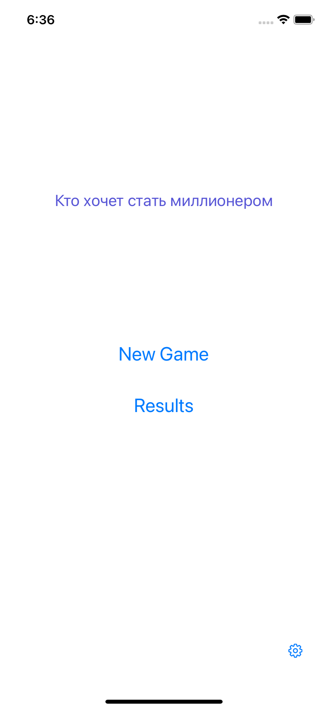
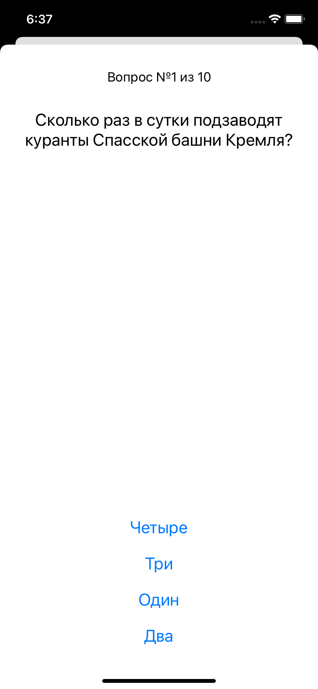
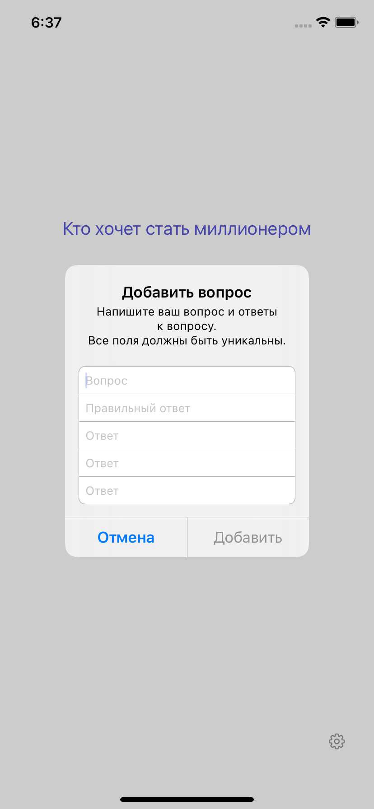
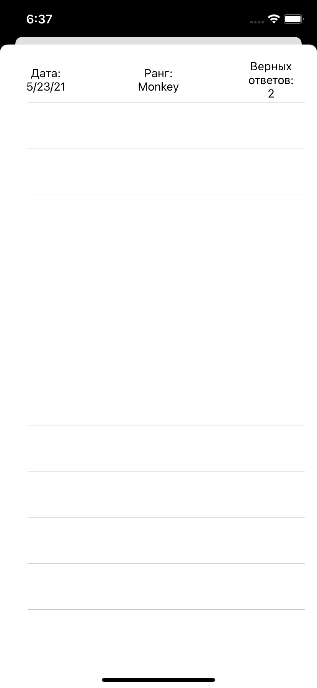

# WhoWantsToBeMillionaire

## Цель проекта
- изучаение паттернов проектирования
- применение паттернов на практике

## Какие паттерны были применены в проекте?
- Delegate;
- Observer;
- Memento;
- Singleton;
- Strategy;

## Функционал:
- Базовый функционал игры с 10 вопросами и 4-мя вариантами ответов;
- Возможность добавления собственных вопросов;
- Выбор способа задания вопросов: последовательно/в произвольном порядке;
- Экран хранимых результатов игры с латой, результатом и рангом.

## Примеры экранов:

       

     

